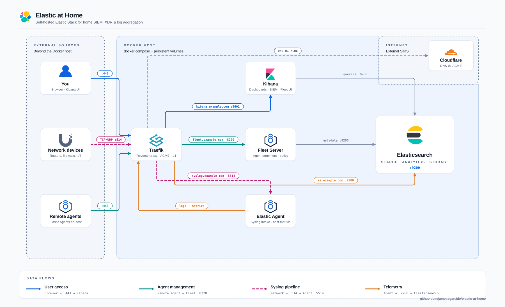
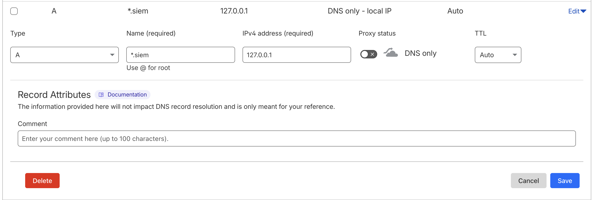

# Elastic at Home

Protect your home and devices using Elastic Security by deploying Elastic at home

## Architecture



> Data flows: Blue = User Access | Teal = Agent Management | Orange = Telemetry | Pink = Syslog Pipeline

## Overview

> [!NOTE]
> For this guide we will be using a Raspberry Pi 5 16GB with RaspiOS Trixie Lite, while some commands given my be specifc for the Raspberry Pi family, the majority of the guide is system agnostic as we will use Docker. Podman may also be used and should have function parity.

In this guide we will walk through deploying a fully functioning SIEM (Security Incident and Events Management) platform along with Endpoint Protection giving full XDR (Extended Detection and Response) capability on consumer hardware such as the Raspberry Pi family, a laptop, an old Desktop or in a Home Lab.

What we'll cover in this Guide:

- Configuring host dependencies
- Installing Docker
- Deploying and Configuring Traefik along with Letencypt Certificates using Cloudflare DNS Challenge
- Deploying and Configuring an Elastic Stack
- Installing Elastic Agent for Endpoint Protection
- Setup Threat Intelligence
- Shipping Network Flow Logs from Ubiquiti (or other Netflow exporting appliance)
- Enabling Security Rules

> [!IMPORTANT]
> The following require a license but can be used for 30 days with a trial license.

- Setting up anomaly detection for Network Traffic and DNS
- Configure Alerting via Slack

### Certificate Modes

Elastic at Home supports three certificate modes to accommodate different deployment scenarios—from fully air-gapped environments to internet-connected setups with publicly trusted certificates.

| Mode                         | Use Case                    | Internet Required | Certificate Trust                              |
| ---------------------------- | --------------------------- | ----------------- | ---------------------------------------------- |
| **Let's Encrypt**            | Production, external agents | Yes (for ACME)    | Publicly trusted (automatic)                   |
| **Self-Signed (Hostname)**   | Air-gapped, internal only   | No                | Browser: click through / Agents: CA trust      |
| **Direct Access (IP:Port)**  | Development, testing        | No                | Browser: click through / Agents: CA trust      |

#### Switching Between Modes

Certificate mode is controlled by a single environment variable. The correct Traefik config file is automatically selected based on `INGRESS_MODE`:

| INGRESS_MODE value  | Config file loaded         | Access Method         |
| ------------------- | -------------------------- | --------------------- |
| `selfsigned`        | `traefik-selfsigned.yml`   | Hostname via port 443 |
| `letsencrypt`       | `traefik-letsencrypt.yml`  | Hostname via port 443 |
| `direct`            | `traefik-direct.yml`       | IP via service ports  |

**Self-Signed Mode (Default)**

Self-signed mode works out of the box with no changes required:

```bash
# .env file - default value
INGRESS_MODE=selfsigned
```

**Let's Encrypt Mode**

To switch to Let's Encrypt with Cloudflare DNS challenge, update your `.env` file:

```bash
INGRESS_MODE=letsencrypt
ACME_EMAIL=your-email@example.com
CF_DNS_API_TOKEN=your-cloudflare-api-token
```

Then restart the stack:

```bash
docker compose down && docker compose up -d
```

##### Direct Access Mode

For IP-based access without DNS configuration:

```bash
INGRESS_MODE=direct
```

Access services via IP and port:

- Kibana: `https://<host-ip>:5601`
- Elasticsearch: `https://<host-ip>:9200`
- Fleet Server: `https://<host-ip>:8220`
- APM Server: `https://<host-ip>:8200`

##### Switching Back to Self-Signed

```bash
# Edit .env: set INGRESS_MODE to selfsigned
INGRESS_MODE=selfsigned
docker compose down && docker compose up -d
```

#### Option 1: Let's Encrypt with Cloudflare DNS Challenge (Recommended)

**Best for:** Production deployments where agents/clients need to trust the stack without manual certificate distribution.

This mode uses Traefik as a reverse proxy with Let's Encrypt certificates obtained via Cloudflare DNS challenge. Certificates are automatically renewed and publicly trusted—no CA distribution required.

**Requirements:**

- A domain registered with a [supported DNS provider](https://go-acme.github.io/lego/dns/index.html)
- API token for DNS provider (e.g., Cloudflare)
- Internet access for ACME certificate requests

#### Option 2: Self-Signed with Traefik

**Best for:** Air-gapped environments or internal networks where you control all clients.

This mode uses Traefik as a reverse proxy with ES CA-signed certificates. All domain names are included as SANs (Subject Alternative Names) in a single certificate.

Traefik properly validates backend service certificates using the internal CA (no `insecureSkipVerify`).

**Requirements:**

- **Browser users:** Click "proceed to site" when prompted about the untrusted certificate. Use incognito/private browsing if you encounter cached certificate issues.
- **Elastic Agents:** Distribute `ca.crt` and configure agents to trust the CA
- No internet access required

**Agent CA Certificate**

For Elastic Agents connecting to Fleet/ES, extract and distribute the CA:

```bash
docker cp $(docker compose ps -q setup):/certs/ca/ca.crt ./ca.crt
```

#### Option 3: Direct Access (IP:Port)

**Best for:** Development, testing, or environments without DNS.

This mode uses Traefik with port-based routing instead of hostname routing. Each service is accessible on its dedicated port via the host IP address. No DNS configuration required.

**Access URLs:**

- Kibana: `https://<host-ip>:5601`
- Elasticsearch: `https://<host-ip>:9200`
- Fleet Server: `https://<host-ip>:8220`
- APM Server: `https://<host-ip>:8200`

**Requirements:**

- **Browser users:** Click "proceed to site" when prompted about the untrusted certificate
- **Elastic Agents:** Distribute `ca.crt` and configure agents to trust the CA
- No DNS configuration required

Extract and distribute the CA for Elastic Agents:

```bash
docker cp $(docker compose ps -q setup):/certs/ca/ca.crt ./ca.crt
```

---

### SSL/TLS using Let's Encrypt Certificates

This guide covers deploying Traefik, a popular reverse proxy technology which includes a bunch of extra functionality including layer 4 (TCP/UDP) routing, Certificate Management and middlewares. In this guide we will use all of this extra functionality with Certificate Management requiring a publically registered domain address. We do this to easily create trust relationships between Clients/Agents and our Elastic Stack, without this we would need to manage and distribute self-signed certificates to anything consuming our Elastic components over TLS or disable certificate authority verification which would reduce the security of the stack.

> [!IMPORTANT]
> We DO NOT need to expose our Elastic Stack or Traefik to the public internet to be able to use Letsencrypt certificates. [This guide uses DNS challenge](https://doc.traefik.io/traefik/reference/install-configuration/tls/certificate-resolvers/acme/#dnschallenge) to prove owenership/control of the domain through a process called ACME.
>
> Traefik uses LEGO for ACME which supports many DNS Providers to programatically issue Certificates. [The entire list can be found here](https://go-acme.github.io/lego/dns/index.html)

This method does mean that internal DNS records will need to be configured within your network which clients are able to resolve. This can either be local to each client/agent or can be configured using common home services like [PiHole](https://pi-hole.net/), [Unifi Network Controllers](https://ui.com/), [PfSense](https://www.pfsense.org/) and even some ISP routers support custom internal records DNS.

> [!IMPORTANT] Using Let's Encrypt with `/etc/hosts` for local DNS resolution
>
> If you're using `/etc/hosts` on your local machine for DNS resolution (instead of a local DNS server like Pi-hole or Unifi), the ACME DNS challenge will fail with errors like `could not find zone for domain`.
>
> **Why this happens:** Traefik uses [Lego](https://go-acme.github.io/lego/) for ACME certificate requests. Before creating the DNS challenge TXT record, Lego performs an SOA (Start of Authority) lookup against **public DNS servers** to determine which zone the domain belongs to. Your local `/etc/hosts` file is not consulted—only public DNS is queried.
>
> **The fix:** Create a placeholder DNS record in your DNS provider (e.g., Cloudflare) for your subdomain. For example, if your services use `*.siem.example.com`, add an A record for `*.siem` pointing to any IP address (e.g., `127.0.0.1`). The actual IP doesn't matter—Lego just needs to find the zone via public DNS. Your local `/etc/hosts` will still handle the actual traffic routing.
> 

This guide will use Unifi for providing interal DNS resolution. A wildcard A record is a good way of providing all the Elastic services under a subdomain which mitigates the need to confiugre a new recored each time you add a new service to Traefik.


#### Elastic at Home Traefik Ingress Architecture including Cloudflare DNS Challenge

Below is a flow diagram of how ingress is handled for Elastic at Home via Traefik using Cloudfalre as the DNS Challenge provider to issue Letsencrypt certs.

```
                                              ┌─────────────────────────────────────────────────────────────────┐
                                              │                         CLOUDFLARE DNS                          │
                                              │  A Records: elastic.*, kibana.*, fleet.* → <Host IP>           │
                                              │  TXT Records: _acme-challenge.* (auto-created for ACME)        │
                                              └──────────────────────────────┬──────────────────────────────────┘
                                                                             │
                                                                             ▼
┌────────────────────┐     ┌─────────────────────────────────────────────────────────────────────────────────────────────────────────────────────────┐
│                    │     │                                              TRAEFIK                                                                    │
│     INTERNET       │     │  ┌───────────────────────────────────────────────────────────────────────────────────────────────────────────────────┐  │
│                    │     │  │ ENTRYPOINTS                               ROUTERS                                    SERVICES                     │  │
│  ┌──────────────┐  │     │  │                                                                                                                   │  │
│  │   Clients    │  │     │  │  ┌─────────────┐    ┌────────────────────────────────────────┐    ┌─────────────────────────────────────────┐     │  │
│  │  (Browsers,  │──┼────►│  │  │ websecure   │───►│ elastic.* ──► TLS:letsencrypt ─────────┼───►│ es01:9200 (Elasticsearch)               │     │  │
│  │   Agents)    │  │ 443 │  │  │ :443        │    │ kibana.*  ──► TLS:letsencrypt ─────────┼───►│ kibana:5601 (Kibana)                    │     │  │
│  └──────────────┘  │     │  │  └─────────────┘    │ fleet.*   ──► TLS:letsencrypt ─────────┼───►│ fleet-server:8220 (Fleet Server)        │     │  │
│                    │     │  │                     │ apm.*     ──► TLS:letsencrypt ─────────┼───►│ fleet-server:8200 (APM)                 │     │  │
│  ┌──────────────┐  │     │  │                     └────────────────────────────────────────┘    └─────────────────────────────────────────┘     │  │
│  │   Syslog     │  │     │  │                                                                                                                   │  │
│  │   Sources    │──┼────►│  │  ┌─────────────┐    ┌────────────────────────────────────────┐    ┌─────────────────────────────────────────┐     │  │
│  │  (Routers,   │  │5514 │  │  │ syslog-tcp  │───►│ ClientIP(`192.168.0.0/16`) ────────────┼───►│ elastic-agent:5514/tcp                  │     │  │
│  │  Firewalls)  │  │     │  │  │ :5514/tcp   │    └────────────────────────────────────────┘    └─────────────────────────────────────────┘     │  │
│  └──────────────┘  │     │  │  └─────────────┘                                                                                                  │  │
│                    │     │  │                                                                                                                   │  │
│  ┌──────────────┐  │     │  │  ┌─────────────┐    ┌────────────────────────────────────────┐    ┌─────────────────────────────────────────┐     │  │
│  │   Syslog     │──┼────►│  │  │ syslog-udp  │───►│ HostSNI(`*`) ──────────────────────────┼───►│ elastic-agent:5514/udp                  │     │  │
│  │   (UDP)      │  │5514 │  │  │ :5514/udp   │    └────────────────────────────────────────┘    └─────────────────────────────────────────┘     │  │
│  └──────────────┘  │     │  │  └─────────────┘                                                                                                  │  │
│                    │     │  └───────────────────────────────────────────────────────────────────────────────────────────────────────────────────┘  │
└────────────────────┘     │                                                                                                                         │
                           │  ┌───────────────────────────────────────────────────────────────────────────────────────────────────────────────────┐  │
                           │  │ CERTIFICATE RESOLVER (Let's Encrypt via DNS-01 Challenge)                                                         │  │
                           │  │                                                                                                                   │  │
                           │  │  1. Request cert ──► 2. DNS-01 challenge ──► 3. Create TXT via Cloudflare API ──► 4. Verify ──► 5. Issue cert     │  │
                           │  │                                                                                                                   │  │
                           │  │  Environment: CF_DNS_API_TOKEN=<token>                                    Storage: /letsencrypt/acme.json         │  │
                           │  └───────────────────────────────────────────────────────────────────────────────────────────────────────────────────┘  │
                           └─────────────────────────────────────────────────────────────────────────────────────────────────────────────────────────┘
                                                                             │
                                                                             ▼
                           ┌─────────────────────────────────────────────────────────────────────────────────────────────────────────────────────────┐
                           │                                          DOCKER NETWORK (elastic)                                                       │
                           │                                                                                                                         │
                           │  ┌─────────────────────┐  ┌─────────────────────┐  ┌─────────────────────┐  ┌─────────────────────┐                     │
                           │  │    Elasticsearch    │  │       Kibana        │  │    Fleet Server     │  │    Elastic Agent    │                     │
                           │  │       (es01)        │  │                     │  │                     │  │                     │                     │
                           │  │      :9200/tcp      │  │     :5601/tcp       │  │  :8220/tcp (Fleet)  │  │  :5514/tcp (Syslog) │                     │
                           │  │                     │  │                     │  │  :8200/tcp (APM)    │  │  :5514/udp (Syslog) │                     │
                           │  └─────────────────────┘  └─────────────────────┘  └─────────────────────┘  └─────────────────────┘                     │
                           └─────────────────────────────────────────────────────────────────────────────────────────────────────────────────────────┘
```

#### Cloudflare as ACME

In this guide we use Cloudflare as our DNS Provider which is supported by Traefiks DNS Challenge domain verification. For other providers please refer to the LEGO documentaion for [supported DNS providers](https://go-acme.github.io/lego/dns/index.html)

## Bill of Materials

> [!NOTE]
> You do not need to use this hardware, the details are provided for context and guidence if you wish to follow along like for like.
> The Raspberry Pi 5 platform is a very good choice for this home Security Operations Centre because it's got enough compute, relatively cheap, power efficiant and available in most countries.
>
> This setup uses Power over Ethernet to power the Raspberry Pi via a POE Hat so you will therefore need a POE compatabile switch or injector.

- [Raspberry Pi 5 (16GB)](https://thepihut.com/products/raspberry-pi-5?variant=53972414431617)
- [GeeekPi P31 M.2 NVMe PoE+ Hat](https://www.amazon.co.uk/dp/B0D7BXGLH8?ref=ppx_yo2ov_dt_b_fed_asin_title)
- [Crucial P310 SSD 1TB M.2 2230 NVMe](https://www.amazon.co.uk/dp/B0D61Z8R1W?ref=ppx_yo2ov_dt_b_fed_asin_title&th=1)

## Guide

### Pre-requisites

> [!NOTE]
> Some of these pre-requisites come from the [Running Elasticsearch in Production](https://www.elastic.co/docs/deploy-manage/deploy/self-managed/install-elasticsearch-docker-prod) guide.

1.  Set `vm.max_map_count` to at least `262144`

    > [!TIP]
    > Each Lucene segment (and Elasticsearch shards contain multiple segments) uses memory-mapped files for efficient I/O. A single shard can easily require dozens of memory mappings, and a busy node with many shards can exhaust the default limit quickly. If this is too low Elasticsearch will throw errors like `max virtual memory areas vm.max_map_count [65530] is too low, increase to at least [262144]`.

    For Raspberry Pi you set this with the following command:

    ```bash
    echo "vm.max_map_count=262144" | sudo tee -a /etc/sysctl.conf && sudo sysctl -p
    ```

2.  Disable Swapping - [Elastic Guide here](https://www.elastic.co/docs/deploy-manage/deploy/self-managed/setup-configuration-memory)

    > [!TIP]
    > We disable swapping on hosts running Elasticsearch for performance reasons. When enabled the operating system using the filesystem as 'extra memory' by moving memory pages to disk. For less memory dependant applications this is a good way to get more out of a systems resources however for Elasticsearch which heavily relys on memory to be performant, needing to fetch memory pages from disk mid operation turns a event which should take nano seconds in to milliseconds. Elasticsearch also heavily uses Java Garbage Collection to clean up unneeded memory usage, while this happens all other Elasticsearch operations are blocked so it's important to make this as quick as possible by not moving data from disk to memory.

    For Raspberry Pi swap can be disabled using:

    `sudo dphys-swapfile swapoff && sudo dphys-swapfile uninstall && sudo systemctl disable dphys-swapfile`
    `

3.  **For Raspberry Pi only** Enable the Linux kernel's control group (cgroup) memory controller.

    ```bash
    sudo sed -i 's/$/ cgroup_enable=memory cgroup_memory=1/' /boot/firmware/cmdline.txt && sudo reboot
    ```

4.  **For Raspberry Pi 5 using NVMe over PCIe only** we what to ensure we can get the most out of the storage. For this guide the [52pi POE+NVMe](https://wiki.52pi.com/index.php?title=EP-0241) is used.

    ```bash
    sudo rpi-eeprom-config --edit
    ```

    adding following line: `PSU_MAX_CURRENT=5000`
    Save it and reboot your Raspberry Pi.

    Ensure PCIe is enabled on Raspberry Pi 5

    Modify /boot/firmware/config.txt

    ```bash
    sudo vi /boot/firmware/config.txt
    ```

    and add the following parameters:

    ```bash
    dtparam=pciex1

    # The connection is certified for Gen 2.0 speed (5 GT/sec), but you can force it to Gen 3.0 (10 GT/sec) by adding the following line after:

    dtparam=pciex1_gen=3
    ```

### Install Docker & Docker Compose

> [!TIP]
> The Offical Docker install instructions can be [found here](https://docs.docker.com/engine/install/linux-postinstall/) if you arent using Debain/RaspOS.

1. Add the Ofccial Docker GPG Key & APT repository

   ```bash
   #Add Docker's official GPG key:
   sudo apt update
   sudo apt install ca-certificates curl
   sudo install -m 0755 -d /etc/apt/keyrings
   sudo curl -fsSL https://download.docker.com/linux/debian/gpg -o /etc/apt/keyrings/docker.asc
   sudo chmod a+r /etc/apt/keyrings/docker.asc

   # Add the repository to Apt sources:
   sudo tee /etc/apt/sources.list.d/docker.sources <<EOF
   Types: deb
   URIs: https://download.docker.com/linux/debian
   Suites: $(. /etc/os-release && echo "$VERSION_CODENAME")
   Components: stable
   Signed-By: /etc/apt/keyrings/docker.asc
   EOF

   sudo apt update
   ```

2. Install the required Docker Packages

   ```bash
   sudo apt install docker-ce docker-ce-cli containerd.io docker-buildx-plugin docker-compose-plugin
   ```

3. Post-install we need to create a docker group and add the current user. We do this to avoid the need for using `sudo` when running `docker` commands.

   ```bash
   sudo groupadd docker
   sudo usermod -aG docker $USER
   newgrp docker
   ```

### Deploy Elastic Cluster

> [!IMPORTANT]
> The Offical Elastic guide for deploying an Elastic Stack using Docker Compose can be found here but is slightly out of date and doesnt include Fleet. As part of this guide we will use a modified version of the Offical Guide which brings functionality up to date and adds Fleet & Agent. A PR will be made to update the Offical guide based off this modified verion. [You can find the offical guide here](https://www.elastic.co/docs/deploy-manage/deploy/self-managed/install-elasticsearch-docker-compose)

1. Clone Elastic at Home repository

   On the device you will be running Elastic on, clone the Elastic at Home repo and `cd` in to it.

   ```bash
   git clone https://github.com/jamesagarside/elastic-at-home.git
   cd elastic-at-home
   ```

2. Copy the `.env.example` file to `.env` by running: `cp .env.example .env`

3. Modify the new .env file: `vi .env`

### Post Deploy Configuration

#### Update SIEM Agent Policy

We need to update the SIEM Agent Policy so it the Syslog Integrations bind to `0.0.0.0` allowing Traefik to route TCP/UDP connections to the input, without this the integration is only listening within the container.

1.

# OLD GUIDE

#### Create `.env` file

1.  Update the `.env` file

2.  Set `ELASTICSEARCH_PASSWORD` to the password you'd like to use as superuser
3.  Set `KIBANA_PASSWORD` to a random string, this will only be used as a system account by kibana
4.  Set `STACK_VERSION` to the latest version of Elastic
5.  Give your cluster a name by setting `CLUSTER_NAME`
6.  The Offical guide suggests changing `ES_PORT` to only allow for localhost connections which we will do as we will be providing external access to Elasticsearch via a reverse proxy
7.  Update `KIBANA_PORT` to only expose Kibana on localhost like we did with Elasticsearch 5601 as we will setup Traefik as our reverse proxy later to security expose our cluster. It should look like :
    ```
    KIBANA_PORT=127.0.0.1:5601
    ```
8.  Add variables for `FLEET_PORT` and `AGENT_PORT` under Kibana Port so we can allow communication from other Agents to Fleet and allow Syslog traffic to the Elastic Agent which will run on this host. These will expose these ports to the wider network using Traefik. The settings should be something like :

    ```
    # Port to expose Fleet to the host
    FLEET_PORT=127.0.0.1:8220

    # Port to expose Elastic Agent to the host
    FLEET_PORT=127.0.0.1:5512
    ```

9.  Now rename `MEM_LIMIT` to `ES_MEM_LIMIT` and add a new variable named `KB_MEM_LIMIT`. In the Offical guide `MEM_LIMIT` is used for both Elasticsearch and Kibana but here we want the Elasticsearch node to have more memory than Kibana. In this example I'm working off a 16GB Raspberry Pi 5 so I will use 1GB for Kibana and 8GB for Elasticsearch. My settings look like this

    ```

    KB_MEM_LIMIT=1073741824
    ES_MEM_LIMIT=8589934592

    ```

10. Now want to add memory limits for Elastic Agent and Elastic Fleet, we will use 1GB for this guide.

    ```

        FLEET_MEM_LIMIT=1073741824
        AGENT_MEM_LIMIT=1073741824

    ```

11. Finally we want to add encryption keys used by Kibana to encrypt various objects within Kibana by adding the following values to the file:

    ```
    # Encryption Keys
    KB_SECURITY_ENCRYPTIONKEY=<random 32char string>
    KB_REPORTING_ENCRYPTIONKEY=<random 32char string>
    KB_OBJECTS_ENCRYPTIONKEY=<random 32char string>
    ```

    We can do this easily with a single bash command:

    ```
    cat >> .env << EOF
    # Kibana Encryption Keys
    KB_SECURITY_ENCRYPTIONKEY=$(openssl rand -base64 32 | tr -dc 'a-zA-Z0-9' | head -c 32)
    KB_REPORTING_ENCRYPTIONKEY=$(openssl rand -base64 32 | tr -dc 'a-zA-Z0-9' | head -c 32)
    KB_OBJECTS_ENCRYPTIONKEY=$(openssl rand -base64 32 | tr -dc 'a-zA-Z0-9' | head -c 32)
    EOF
    ```

Overall your .env should look something like:

````

# Password for the 'elastic' user (at least 6 characters)

ELASTIC_PASSWORD=changeme

# Password for the 'kibana_system' user (at least 6 characters)

KIBANA_PASSWORD=changeme

# Version of Elastic products

STACK_VERSION=9.2.2

# Set the cluster name

CLUSTER_NAME=elastic-at-home

# Set to 'basic' or 'trial' to automatically start the 30-day trial

LICENSE=basic
#LICENSE=trial

# Port to expose Elasticsearch HTTP API to the host

ES_PORT=127.0.0.1:9200

# Port to expose Kibana to the host

KIBANA_PORT=127.0.0.1:5601

# Port to expose Fleet to the host

FLEET_PORT=127.0.0.1:8220

# Port to expose Elastic Agent to the host

FLEET_PORT=127.0.0.1:5512

# Increase or decrease based on the available host memory (in bytes)

KB_MEM_LIMIT=1073741824
ES_MEM_LIMIT=8589934592
FLEET_MEM_LIMIT=1073741824
AGENT_MEM_LIMIT=1073741824

# Kibana Encryption Keys

KB_SECURITY_ENCRYPTIONKEY=fRDzAmciu0Sv3c0S8lKxJMrxJbEoEKG1
KB_REPORTING_ENCRYPTIONKEY=Ih2qXq9iuXdiXg1jo4yXZV8gJWc6stzH
KB_OBJECTS_ENCRYPTIONKEY=ny6tYXoI3lYrRcpgMSMQAkrSBen8dE9K

```

#### Configure `docker-compose.yaml`

##### Modify Elastic default configuration

The `docker-compose.yaml` file contains all of the configuration which docker will use to run and configure our Elastic Stack.

We will use the `docker-compose.yaml` file provided in the [Start a multi-node cluster with Docker Compose Elastic Guide](https://www.elastic.co/docs/deploy-manage/deploy/self-managed/install-elasticsearch-docker-compose) as a base for our Elastic stack with some modifications such as:

- Removing the extra two Elasticsearch nodes. While this might seem counterintuative, "more node mean more better" and all that, as we're running on a single host all extra nodes will do is add latency and unneededly consume resources.
- Use extra Environment Variables to give more control
- Further configure Elasticsearch to be production ready as a single node
- Further configure Kibana to be production ready
- Add Treafik ingress annotations to Kibana and Elasticsearch to expose them securely within our network.
- Add Fleet so we can centrally manage Elastic Agents
- Add an Elastic Agent which will be used for recieving data streamed from our home network devices

> [!NOTE]
> We will keep the certificate generation for the extra nodes in case case extra nodes wish to be added at a later date

1. Remove the compose `version: "2.2"` at the top of the file as its now deprecated
2. Remove the `cluster.initial_master_nodes=es01,es02,es03` and the `discovery.seed_hosts=es02,es03` lines within the `es01:environment` section replacing them with `discovery.type=single-node`. The final line should look like

```

- discovery.type=single-node

```

3. Find the sections within the compose file named `es02` and `es03` and completely remove them.
4. Remove any reference to `es02` and `es03` within the `kibana` section under the `depends_on` key.
5. Update the `mem_limit` values for `es01` and `kibana` to use the new variables within the `.env` file. They should look like this respectively:

```

# es01

mem_limit: ${ES_MEM_LIMIT}

# kibana

mem_limit: ${KB_MEM_LIMIT}

```

6. Add the following lines to the `kibana.environment` section.
```

       - XPACK_SECURITY_ENCRYPTIONKEY=${KB_SECURITY_ENCRYPTIONKEY}
       - XPACK_REPORTING_ENCRYPTIONKEY=${KB_REPORTING_ENCRYPTIONKEY}
       - XPACK_ENCRYPTEDSAVEDOBJECTS_ENCRYPTIONKEY=${KB_OBJECTS_ENCRYPTIONKEY}

```
7. Remove the volumes `esdata02` and `esdata03` from the bottom of the `docker-compose.yaml` file.

Your final `docker-compose.yaml` should look like this:

```

services:
setup:
image: docker.elastic.co/elasticsearch/elasticsearch:${STACK_VERSION}
    volumes:
      - certs:/usr/share/elasticsearch/config/certs
    user: "0"
    command: >
      bash -c '
        if [ x${ELASTIC_PASSWORD} == x ]; then
echo "Set the ELASTIC_PASSWORD environment variable in the .env file";
exit 1;
elif [ x${KIBANA_PASSWORD} == x ]; then
echo "Set the KIBANA_PASSWORD environment variable in the .env file";
exit 1;
fi;
if [ ! -f config/certs/ca.zip ]; then
echo "Creating CA";
bin/elasticsearch-certutil ca --silent --pem -out config/certs/ca.zip;
unzip config/certs/ca.zip -d config/certs;
fi;
if [ ! -f config/certs/certs.zip ]; then
echo "Creating certs";
echo -ne \
 "instances:\n"\
 " - name: es01\n"\
 " dns:\n"\
 " - es01\n"\
 " - localhost\n"\
 " ip:\n"\
 " - 127.0.0.1\n"\
 " - name: es02\n"\
 " dns:\n"\
 " - es02\n"\
 " - localhost\n"\
 " ip:\n"\
 " - 127.0.0.1\n"\
 " - name: es03\n"\
 " dns:\n"\
 " - es03\n"\
 " - localhost\n"\
 " ip:\n"\
 " - 127.0.0.1\n"\

> config/certs/instances.yml;
> bin/elasticsearch-certutil cert --silent --pem -out config/certs/certs.zip --in config/certs/instances.yml --ca-cert config/certs/ca/ca.crt --ca-key config/certs/ca/ca.key;
> unzip config/certs/certs.zip -d config/certs;
> fi;
> echo "Setting file permissions"
> chown -R root:root config/certs;
> find . -type d -exec chmod 750 \{\} \;;
> find . -type f -exec chmod 640 \{\} \;;
> echo "Waiting for Elasticsearch availability";
> until curl -s --cacert config/certs/ca/ca.crt https://es01:9200 | grep -q "missing authentication credentials"; do sleep 30; done;
> echo "Setting kibana_system password";
> until curl -s -X POST --cacert config/certs/ca/ca.crt -u "elastic:${ELASTIC_PASSWORD}" -H "Content-Type: application/json" https://es01:9200/_security/user/kibana_system/_password -d "{\"password\":\"${KIBANA_PASSWORD}\"}" | grep -q "^{}"; do sleep 10; done;
> echo "All done!";
> '
> healthcheck:
> test: ["CMD-SHELL", "[ -f config/certs/es01/es01.crt ]"]
> interval: 1s
> timeout: 5s
> retries: 120

es01:
depends_on:
setup:
condition: service_healthy
image: docker.elastic.co/elasticsearch/elasticsearch:${STACK_VERSION}
    volumes:
      - certs:/usr/share/elasticsearch/config/certs
      - esdata01:/usr/share/elasticsearch/data
    ports:
      - ${ES_PORT}:9200
    environment:
      - node.name=es01
      - cluster.name=${CLUSTER_NAME} - discovery.type=single-node - ELASTIC_PASSWORD=${ELASTIC_PASSWORD}
      - bootstrap.memory_lock=true
      - xpack.security.enabled=true
      - xpack.security.http.ssl.enabled=true
      - xpack.security.http.ssl.key=certs/es01/es01.key
      - xpack.security.http.ssl.certificate=certs/es01/es01.crt
      - xpack.security.http.ssl.certificate_authorities=certs/ca/ca.crt
      - xpack.security.transport.ssl.enabled=true
      - xpack.security.transport.ssl.key=certs/es01/es01.key
      - xpack.security.transport.ssl.certificate=certs/es01/es01.crt
      - xpack.security.transport.ssl.certificate_authorities=certs/ca/ca.crt
      - xpack.security.transport.ssl.verification_mode=certificate
      - xpack.license.self_generated.type=${LICENSE} - xpack.ml.use_auto_machine_memory_percent=true
mem_limit: ${ES_MEM_LIMIT}
ulimits:
memlock:
soft: -1
hard: -1
healthcheck:
test:
[
"CMD-SHELL",
"curl -s --cacert config/certs/ca/ca.crt https://localhost:9200 | grep -q 'missing authentication credentials'",
]
interval: 10s
timeout: 10s
retries: 120

kibana:
depends_on:
es01:
condition: service_healthy
image: docker.elastic.co/kibana/kibana:${STACK_VERSION}
    volumes:
      - certs:/usr/share/kibana/config/certs
      - kibanadata:/usr/share/kibana/data
    ports:
      - ${KIBANA_PORT}:5601
    environment:
      - SERVERNAME=kibana
      - ELASTICSEARCH_HOSTS=https://es01:9200
      - ELASTICSEARCH_USERNAME=kibana_system
      - ELASTICSEARCH_PASSWORD=${KIBANA_PASSWORD} - ELASTICSEARCH_SSL_CERTIFICATEAUTHORITIES=config/certs/ca/ca.crt - XPACK_SECURITY_ENCRYPTIONKEY=${KB_SECURITY_ENCRYPTIONKEY}
      - XPACK_REPORTING_ENCRYPTIONKEY=${KB_REPORTING_ENCRYPTIONKEY} - XPACK_ENCRYPTEDSAVEDOBJECTS_ENCRYPTIONKEY=${KB_OBJECTS_ENCRYPTIONKEY}
mem_limit: ${KB_MEM_LIMIT}
healthcheck:
test:
[
"CMD-SHELL",
"curl -s -I http://localhost:5601 | grep -q 'HTTP/1.1 302 Found'",
]
interval: 10s
timeout: 10s
retries: 120

volumes:
certs:
driver: local
esdata01:
driver: local
kibanadata:
driver: local

```

##### Add Fleet

We will now add Fleet to the compose file. Fleet is used to centrally mange Elastic Agents connected to our cluster handling their policies and health.
```
````
