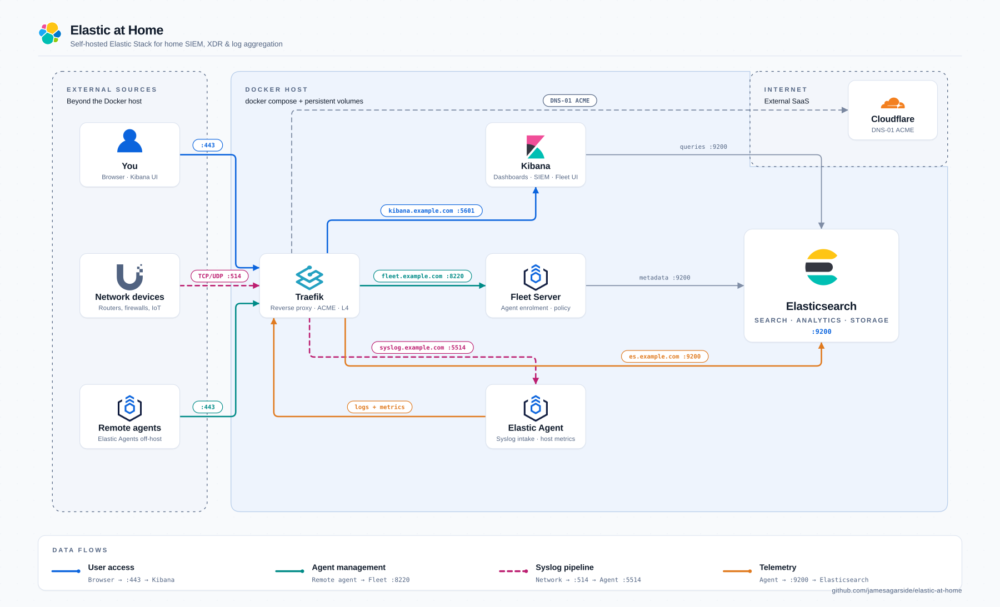
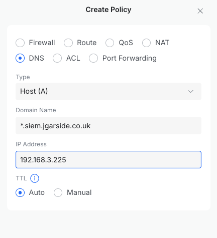
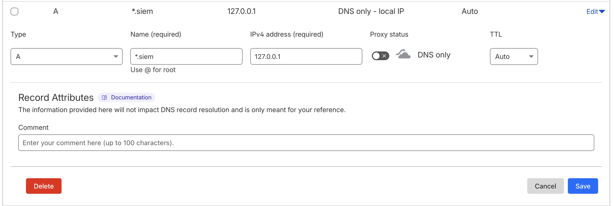

# Elastic at Home

[](LICENSE)
[](https://github.com/jamesagarside/elastic-at-home/releases/latest)
[](https://github.com/jamesagarside/elastic-at-home/stargazers)
[](https://github.com/jamesagarside/elastic-at-home/commits)
[](https://www.elastic.co/)
[](https://docs.docker.com/compose/)
[](https://www.raspberrypi.com/)
[](https://traefik.io/)

**A self-hosted SIEM and XDR platform for your home network, built on the Elastic Stack, Docker Compose, and a Raspberry Pi.**

Elastic at Home turns a single low-cost device into a full home Security Operations Centre: SIEM, endpoint detection and response (EDR), threat intelligence, syslog ingestion from your router/firewall, ML-based anomaly detection, and an optional local LLM for private AI-assisted investigation. Everything runs in containers, all traffic is TLS-encrypted, and nothing has to leave your network.



> Data flows: **Blue** = User access · **Teal** = Agent management · **Orange** = Telemetry · **Pink** = Syslog pipeline

---

## Table of Contents

- [Why Elastic at Home?](#why-elastic-at-home)
- [Features](#features)
- [Quick Start](#quick-start)
- [Bill of Materials](#bill-of-materials)
- [Prerequisites](#prerequisites)
- [Install Docker](#install-docker--docker-compose)
- [Deploy the Elastic Stack](#deploy-the-elastic-stack)
- [Access Your Stack](#access-your-stack)
- [Certificate Modes](#certificate-modes)
- [Local LLM (Optional)](#local-llm-optional)
- [Project Structure](#project-structure)
- [Core Concepts](#core-concepts)
- [Troubleshooting](#troubleshooting)
- [FAQ](#faq)

---

## Why Elastic at Home?

Commercial home security tools are closed, data-hungry, and rarely cross-correlate network and endpoint signals. Enterprise SIEMs are powerful but priced for enterprises. Elastic at Home bridges the gap: the same Elastic Security platform that runs in Fortune 500 SOCs, deployed on a Raspberry Pi 5 in your cupboard, watching your home network and devices, for the cost of the hardware.

**Who this is for:** home-lab enthusiasts, security professionals who want a practice environment, privacy-conscious users, and anyone who wants real visibility into what's happening on their network.

## Features

- **SIEM**: Elastic Security with pre-built detection rules, alerts, timelines, and investigation workflows
- **EDR / XDR**: Elastic Defend endpoint agent for process, file, and network telemetry
- **Syslog ingestion**: TCP and UDP pipelines for routers, firewalls, and switches (Ubiquiti, pfSense, OPNsense, etc.)
- **Threat intelligence**: integrations with open and commercial threat feeds
- **ML anomaly detection**: DNS and network-traffic anomaly jobs (trial/Platinum)
- **Slack alerting**: push high-severity detections to your phone
- **Fleet-managed agents**: centrally configure every agent from Kibana
- **Local LLM (optional)**: Ollama plus Google Gemma 4 E2B powers the Kibana AI Assistant without leaving your network
- **Three ingress modes**: Let's Encrypt (public trust), self-signed (air-gapped), or direct IP:port (no DNS)
- **One-command deployment**: `docker compose up -d` and the stack bootstraps itself

---

## Quick Start

Get a running Elastic Stack in under 5 minutes (Docker already installed):

```bash
# 1. Clone the repository
git clone https://github.com/jamesagarside/elastic-at-home.git
cd elastic-at-home

# 2. Create your environment file
cp .env.example .env

# 3. Edit .env and set:
#    - ELASTIC_PASSWORD   (admin password)
#    - KIBANA_PASSWORD    (internal Kibana password)
#    - INGRESS_MODE       (selfsigned | letsencrypt | direct)

# 4. Start the stack
docker compose up -d

# 5. Wait for services to be healthy (~3-5 minutes)
docker compose ps

# 6. Open Kibana
#    selfsigned/letsencrypt:  https://kibana.yourdomain.com
#    direct:                  https://<host-ip>:5601
#    Username: elastic
#    Password: <your ELASTIC_PASSWORD>
```

> **First time?** Use `INGRESS_MODE=selfsigned`. It works without DNS. You'll see a browser certificate warning (click *Advanced*, then *Proceed*); everything else works normally.

For a step-by-step walk-through, jump to [Prerequisites](#prerequisites).

---

## Bill of Materials

> [!NOTE]
> You do not need this exact hardware; it's provided for context. Any x86/ARM Linux host with 16 GB of RAM, Docker, and a few hundred GB of storage will work. The Raspberry Pi 5 platform is recommended because it's cheap, power-efficient, and widely available.

- [Raspberry Pi 5 (16 GB)](https://thepihut.com/products/raspberry-pi-5?variant=53972414431617)
- [GeeekPi P31 M.2 NVMe PoE+ Hat](https://www.amazon.co.uk/dp/B0D7BXGLH8?ref=ppx_yo2ov_dt_b_fed_asin_title)
- [Crucial P310 SSD 1TB M.2 2230 NVMe](https://www.amazon.co.uk/dp/B0D61Z8R1W?ref=ppx_yo2ov_dt_b_fed_asin_title&th=1)

The setup uses Power over Ethernet, so you'll need a PoE-capable switch or injector.

---

## Prerequisites

> [!NOTE]
> Some of these come from the official [Running Elasticsearch in Production](https://www.elastic.co/docs/deploy-manage/deploy/self-managed/install-elasticsearch-docker-prod) guide.

### 1. Set `vm.max_map_count` to at least `262144`

> [!TIP]
> Elasticsearch uses memory-mapped files for each Lucene segment. Busy nodes exhaust the default quickly, producing errors like `max virtual memory areas vm.max_map_count [65530] is too low`.

```bash
echo "vm.max_map_count=262144" | sudo tee -a /etc/sysctl.conf && sudo sysctl -p
```

### 2. Disable swap

> [!TIP]
> Elasticsearch is memory-hungry and blocks during Java GC. Swapping a hot page to disk turns a nanosecond read into a millisecond one. See the [Elastic guide on memory configuration](https://www.elastic.co/docs/deploy-manage/deploy/self-managed/setup-configuration-memory).

**Raspberry Pi OS** (uses `dphys-swapfile`):

```bash
sudo dphys-swapfile swapoff && sudo dphys-swapfile uninstall && sudo systemctl disable dphys-swapfile
```

**Other Debian/Ubuntu hosts** (no `dphys-swapfile`):

```bash
sudo swapoff -a
# Comment out (or remove) any swap entries in /etc/fstab so swap stays off across reboots
sudo sed -i.bak '/\sswap\s/s/^/# /' /etc/fstab
```

### 3. Enable cgroup memory controller (Raspberry Pi only)

```bash
sudo sed -i 's/$/ cgroup_enable=memory cgroup_memory=1/' /boot/firmware/cmdline.txt && sudo reboot
```

### 4. Tune NVMe over PCIe (Raspberry Pi 5 only)

For the [52pi POE+NVMe](https://wiki.52pi.com/index.php?title=EP-0241) hat:

```bash
sudo rpi-eeprom-config --edit
# Add:  PSU_MAX_CURRENT=5000
# Save and reboot
```

Enable PCIe in `/boot/firmware/config.txt`:

```ini
dtparam=pciex1
# Optional: force Gen 3.0 (10 GT/sec). The connector is only certified for Gen 2.0.
dtparam=pciex1_gen=3
```

---

## Install Docker & Docker Compose

> [!TIP]
> If you're not on Debian/Raspberry Pi OS, follow the [official Docker install instructions](https://docs.docker.com/engine/install/linux-postinstall/) instead.

```bash
# Add Docker's official GPG key
sudo apt update
sudo apt install ca-certificates curl
sudo install -m 0755 -d /etc/apt/keyrings
sudo curl -fsSL https://download.docker.com/linux/debian/gpg -o /etc/apt/keyrings/docker.asc
sudo chmod a+r /etc/apt/keyrings/docker.asc

# Add the repository
sudo tee /etc/apt/sources.list.d/docker.sources <<EOF
Types: deb
URIs: https://download.docker.com/linux/debian
Suites: $(. /etc/os-release && echo "$VERSION_CODENAME")
Components: stable
Signed-By: /etc/apt/keyrings/docker.asc
EOF
sudo apt update

# Install Docker
sudo apt install docker-ce docker-ce-cli containerd.io docker-buildx-plugin docker-compose-plugin

# Allow your user to run Docker without sudo
# (idempotent: only creates the group if it doesn't already exist)
getent group docker >/dev/null || sudo groupadd docker
sudo usermod -aG docker $USER
# Apply the new group in the current shell; alternatively log out and back in
newgrp docker
```

---

## Deploy the Elastic Stack

> [!IMPORTANT]
> The official [Elastic Docker Compose guide](https://www.elastic.co/docs/deploy-manage/deploy/self-managed/install-elasticsearch-docker-compose) is slightly out of date and doesn't include Fleet. Elastic at Home is a modernised fork that adds Fleet, Agent, Traefik, and three ingress modes.

### 1. Clone the repository

```bash
git clone https://github.com/jamesagarside/elastic-at-home.git
cd elastic-at-home
```

### 2. Create your `.env` file

```bash
cp .env.example .env
vi .env
```

**Required settings:**

```bash
# Security credentials (CHANGE THESE!)
ELASTIC_PASSWORD=YourSecurePassword123!
KIBANA_PASSWORD=AnotherSecurePassword456!

# Choose your certificate mode
INGRESS_MODE=selfsigned    # selfsigned | letsencrypt | direct

# Domain names (selfsigned / letsencrypt modes)
ES_DOMAIN_NAME=es.yourdomain.com
KIBANA_DOMAIN_NAME=kibana.yourdomain.com
FLEET_DOMAIN_NAME=fleet.yourdomain.com
```

> **Tip:** For quick local testing, use `INGRESS_MODE=direct`; it needs no DNS.

### 3. Start the stack

```bash
docker compose up -d
```

The first boot takes 3 to 5 minutes as the stack generates TLS certificates, initialises Elasticsearch, configures Kibana and Fleet, and enrols the SIEM agent.

### 4. Verify all services are healthy

```bash
docker compose ps
```

Expected output:

```text
NAME                            STATUS
elastic-at-home-es01-1          Up (healthy)
elastic-at-home-kibana-1        Up (healthy)
elastic-at-home-fleet-server-1  Up (healthy)
elastic-at-home-agent-1         Up
elastic-at-home-traefik-1       Up
elastic-at-home-setup-1         Up (healthy)
```

> If anything shows `unhealthy`, jump to [Troubleshooting](#troubleshooting).

---

## Access Your Stack

### Credentials

| Setting      | Value                               |
| ------------ | ----------------------------------- |
| **Username** | `elastic`                           |
| **Password** | Your `ELASTIC_PASSWORD` from `.env` |

### URLs by mode

**Self-signed** (`INGRESS_MODE=selfsigned`):

| Service       | URL                            |
| ------------- | ------------------------------ |
| Kibana        | `https://<KIBANA_DOMAIN_NAME>` |
| Elasticsearch | `https://<ES_DOMAIN_NAME>`     |
| Fleet         | `https://<FLEET_DOMAIN_NAME>`  |

> Requires DNS or `/etc/hosts` entries pointing your domains to the host IP.

**Let's Encrypt** (`INGRESS_MODE=letsencrypt`): same URLs as self-signed, but with publicly trusted certificates (no browser warnings).

**Direct** (`INGRESS_MODE=direct`):

| Service       | URL                      |
| ------------- | ------------------------ |
| Kibana        | `https://<host-ip>:5601` |
| Elasticsearch | `https://<host-ip>:9200` |
| Fleet         | `https://<host-ip>:8220` |

> No DNS required. IP and port only.

### First login

1. Navigate to Kibana in your browser
2. Accept the certificate warning (self-signed/direct only)
3. Log in with `elastic` and your `ELASTIC_PASSWORD`
4. Go to **Security > Overview** to see your SIEM dashboard

### Verify Fleet agent

1. **Management > Fleet** in Kibana
2. Confirm `siem-agent` is enrolled and **Healthy**
3. The agent is already collecting system logs and metrics

---

## Certificate Modes

Elastic at Home supports three TLS/ingress modes. Pick the one that matches your environment; all other configuration adjusts automatically.

| Mode             | Best for                     | Internet required | Trust chain                              | Access via        |
| ---------------- | ---------------------------- | ----------------- | ---------------------------------------- | ----------------- |
| **selfsigned**   | Air-gapped, internal only    | No                | Click-through (browser) / CA distribution (agents) | Hostname :443     |
| **letsencrypt**  | Production, external agents  | Yes (ACME)        | Publicly trusted (automatic)             | Hostname :443     |
| **direct**       | Dev, testing, no DNS         | No                | Click-through (browser) / CA distribution (agents) | IP : service-port |

Switching is a single variable:

```bash
INGRESS_MODE=letsencrypt   # or selfsigned | direct
```

Docker Compose then loads the right Traefik config (`traefik-<mode>.yml`) and env file (`configurations/elastic/env_files/.env.<mode>`) automatically.

### How mode-specific env files work

Each mode lives in `configurations/elastic/env_files/`:

```text
.env.selfsigned     # CA paths for internal validation
.env.letsencrypt    # No custom CA, uses system trust store
.env.direct         # CA paths for internal validation
```

Services load the right one via:

```yaml
env_file:
  - configurations/elastic/env_files/.env.${INGRESS_MODE:-selfsigned}
```

### Why do self-signed/direct need a CA path but Let's Encrypt doesn't?

| Variable           | selfsigned & direct | letsencrypt | Purpose                                    |
| ------------------ | ------------------- | ----------- | ------------------------------------------ |
| `FLEET_CA`         | `/certs/ca/ca.crt`  | unset       | Fleet Server to Elasticsearch validation   |
| `ELASTICSEARCH_CA` | `/certs/ca/ca.crt`  | unset       | Agent to Elasticsearch validation          |
| `KIBANA_FLEET_CA`  | `/certs/ca/ca.crt`  | unset       | Kibana to Fleet Server validation          |

- **selfsigned/direct**: Traefik serves certs signed by Elasticsearch's internal CA, so agents need `ca.crt` to validate them. Without it: `certificate signed by unknown authority`.
- **letsencrypt**: Traefik serves publicly trusted certs. The system trust store already has the Let's Encrypt root; specifying a custom CA would break the chain.

### Let's Encrypt with Cloudflare DNS challenge

**Best for:** production deployments where agents need public trust with no manual CA distribution.

Traefik obtains certificates via the [ACME DNS-01 challenge](https://doc.traefik.io/traefik/reference/install-configuration/tls/certificate-resolvers/acme/#dnschallenge) using [Lego](https://go-acme.github.io/lego/), which supports [many DNS providers](https://go-acme.github.io/lego/dns/index.html). Certificates renew automatically.

**Requirements:**

- A domain at a [supported DNS provider](https://go-acme.github.io/lego/dns/index.html)
- API token for that provider (e.g. Cloudflare)
- Outbound internet access for ACME

> [!IMPORTANT]
> You do **not** need to expose your stack to the public internet. The DNS-01 challenge proves domain ownership by creating a TXT record via the provider's API.

Configure in `.env`:

```bash
INGRESS_MODE=letsencrypt
ACME_EMAIL=your-email@example.com
CF_DNS_API_TOKEN=your-cloudflare-api-token
```

Then redeploy:

```bash
docker compose down && docker compose up -d
```

This method requires internal DNS records your clients can resolve. Options include [Pi-hole](https://pi-hole.net/), [Unifi](https://ui.com/), [pfSense](https://www.pfsense.org/), or custom records on your ISP router. A wildcard A record (`*.siem.example.com` to `<host-ip>`) saves maintenance as you add services.



> [!IMPORTANT]
> **Using `/etc/hosts` instead of a DNS server?** ACME will fail with `could not find zone for domain`. Lego does a public-DNS SOA lookup before creating the challenge record; it never reads `/etc/hosts`.
>
> **Fix:** create a placeholder A record at your DNS provider (e.g. `*.siem.example.com` to `127.0.0.1`). Lego just needs to resolve the zone publicly; your local `/etc/hosts` still handles the real traffic.
> 

### Self-signed with Traefik

**Best for:** air-gapped networks or internal-only deployments.

Traefik reverse-proxies with certificates signed by Elasticsearch's built-in CA. All domain names are SANs in one certificate. Traefik validates backend service certs using the internal CA (no `insecureSkipVerify`).

**Requirements:**

- **Browsers:** click *Proceed* past the warning (use an incognito window to avoid cached cert issues)
- **Agents:** distribute `ca.crt` and configure them to trust it
- No internet access required

Extract the CA for agents:

```bash
docker cp $(docker compose ps -q setup):/certs/ca/ca.crt ./ca.crt
```

Default mode; no `.env` changes needed:

```bash
INGRESS_MODE=selfsigned
```

### Direct access (IP : port)

**Best for:** development, testing, or environments without DNS.

Traefik uses port-based routing. Each service has its own host port.

| Service       | URL                      |
| ------------- | ------------------------ |
| Kibana        | `https://<host-ip>:5601` |
| Elasticsearch | `https://<host-ip>:9200` |
| Fleet Server  | `https://<host-ip>:8220` |
| APM Server    | `https://<host-ip>:8200` |

Same CA distribution steps as self-signed mode apply for agents.

```bash
INGRESS_MODE=direct
```

### Expected log messages

> [!NOTE]
> In **selfsigned** and **direct** modes, Traefik logs like this are **expected and safe to ignore**:
>
> `ERR Router uses a nonexistent certificate resolver certificateResolver=selfsigned routerName=kibana@docker`
>
> The Docker labels reference a resolver that only exists in Let's Encrypt mode; Traefik falls back to the TLS certificates from the dynamic config.

### Traefik ingress flow (Let's Encrypt with Cloudflare)

<details>
<summary>Click to expand ASCII flow diagram</summary>

```text
                                              ┌─────────────────────────────────────────────────────────────────┐
                                              │                         CLOUDFLARE DNS                          │
                                              │  A Records: elastic.*, kibana.*, fleet.* → <Host IP>           │
                                              │  TXT Records: _acme-challenge.* (auto-created for ACME)        │
                                              └──────────────────────────────┬──────────────────────────────────┘
                                                                             │
                                                                             ▼
┌────────────────────┐     ┌─────────────────────────────────────────────────────────────────────────────────────────────────────────────────────────┐
│                    │     │                                              TRAEFIK                                                                    │
│     INTERNET       │     │  ┌───────────────────────────────────────────────────────────────────────────────────────────────────────────────────┐  │
│                    │     │  │ ENTRYPOINTS                               ROUTERS                                    SERVICES                     │  │
│  ┌──────────────┐  │     │  │                                                                                                                   │  │
│  │   Clients    │  │     │  │  ┌─────────────┐    ┌────────────────────────────────────────┐    ┌─────────────────────────────────────────┐     │  │
│  │  (Browsers,  │──┼────►│  │  │ websecure   │───►│ elastic.* ──► TLS:letsencrypt ─────────┼───►│ es01:9200 (Elasticsearch)               │     │  │
│  │   Agents)    │  │ 443 │  │  │ :443        │    │ kibana.*  ──► TLS:letsencrypt ─────────┼───►│ kibana:5601 (Kibana)                    │     │  │
│  └──────────────┘  │     │  │  └─────────────┘    │ fleet.*   ──► TLS:letsencrypt ─────────┼───►│ fleet-server:8220 (Fleet Server)        │     │  │
│                    │     │  │                     │ apm.*     ──► TLS:letsencrypt ─────────┼───►│ fleet-server:8200 (APM)                 │     │  │
│  ┌──────────────┐  │     │  │                     └────────────────────────────────────────┘    └─────────────────────────────────────────┘     │  │
│  │   Syslog     │  │     │  │                                                                                                                   │  │
│  │   Sources    │──┼────►│  │  ┌─────────────┐    ┌────────────────────────────────────────┐    ┌─────────────────────────────────────────┐     │  │
│  │  (Routers,   │  │5514 │  │  │ syslog-tcp  │───►│ ClientIP(`192.168.0.0/16`) ────────────┼───►│ elastic-agent:5514/tcp                  │     │  │
│  │  Firewalls)  │  │     │  │  │ :5514/tcp   │    └────────────────────────────────────────┘    └─────────────────────────────────────────┘     │  │
│  └──────────────┘  │     │  │  └─────────────┘                                                                                                  │  │
│                    │     │  │                                                                                                                   │  │
│  ┌──────────────┐  │     │  │  ┌─────────────┐    ┌────────────────────────────────────────┐    ┌─────────────────────────────────────────┐     │  │
│  │   Syslog     │──┼────►│  │  │ syslog-udp  │───►│ HostSNI(`*`) ──────────────────────────┼───►│ elastic-agent:5514/udp                  │     │  │
│  │   (UDP)      │  │5514 │  │  │ :5514/udp   │    └────────────────────────────────────────┘    └─────────────────────────────────────────┘     │  │
│  └──────────────┘  │     │  │  └─────────────┘                                                                                                  │  │
│                    │     │  └───────────────────────────────────────────────────────────────────────────────────────────────────────────────────┘  │
└────────────────────┘     │                                                                                                                         │
                           │  ┌───────────────────────────────────────────────────────────────────────────────────────────────────────────────────┐  │
                           │  │ CERTIFICATE RESOLVER (Let's Encrypt via DNS-01 Challenge)                                                         │  │
                           │  │                                                                                                                   │  │
                           │  │  1. Request cert ──► 2. DNS-01 challenge ──► 3. Create TXT via Cloudflare API ──► 4. Verify ──► 5. Issue cert     │  │
                           │  │                                                                                                                   │  │
                           │  │  Environment: CF_DNS_API_TOKEN=<token>                                    Storage: /letsencrypt/acme.json         │  │
                           │  └───────────────────────────────────────────────────────────────────────────────────────────────────────────────────┘  │
                           └─────────────────────────────────────────────────────────────────────────────────────────────────────────────────────────┘
                                                                             │
                                                                             ▼
                           ┌─────────────────────────────────────────────────────────────────────────────────────────────────────────────────────────┐
                           │                                          DOCKER NETWORK (elastic)                                                       │
                           │                                                                                                                         │
                           │  ┌─────────────────────┐  ┌─────────────────────┐  ┌─────────────────────┐  ┌─────────────────────┐                     │
                           │  │    Elasticsearch    │  │       Kibana        │  │    Fleet Server     │  │    Elastic Agent    │                     │
                           │  │       (es01)        │  │                     │  │                     │  │                     │                     │
                           │  │      :9200/tcp      │  │     :5601/tcp       │  │  :8220/tcp (Fleet)  │  │  :5514/tcp (Syslog) │                     │
                           │  │                     │  │                     │  │  :8200/tcp (APM)    │  │  :5514/udp (Syslog) │                     │
                           │  └─────────────────────┘  └─────────────────────┘  └─────────────────────┘  └─────────────────────┘                     │
                           └─────────────────────────────────────────────────────────────────────────────────────────────────────────────────────────┘
```

</details>

---

## Local LLM (Optional)

Elastic at Home ships with optional support for a local Large Language Model via [Ollama](https://ollama.com), running Google [Gemma 4 E2B](https://deepmind.google/models/gemma/gemma-4/) (2B parameters). This lets you use Elasticsearch's AI features (Kibana AI Assistant, semantic search, inference pipelines) **without sending any data to external providers**.

> [!IMPORTANT]
> **Trial license (30-day limit).** When the LLM is enabled, the setup container activates an Elasticsearch **trial license**. GenAI connectors (which wire the Kibana AI Assistant to the local model) are an Enterprise feature. The trial provides full Enterprise functionality free for **30 days**, after which the cluster reverts to Basic and the following stop working:
>
> | Feature                                | After trial expires |
> | -------------------------------------- | ------------------- |
> | Kibana AI Assistant (GenAI connector)  | Disabled            |
> | Machine Learning anomaly detection     | Disabled            |
> | Watcher / advanced alerting            | Disabled            |
> | Graph exploration                      | Disabled            |
> | Field-level & document-level security  | Disabled            |
>
> **What keeps working on Basic:**
>
> - Elastic Security SIEM (detection rules, alerts, timelines)
> - Fleet & Elastic Agent management
> - Elasticsearch search & aggregations
> - Kibana dashboards & visualisations
> - Ollama container & inference endpoint (direct API use)
> - Syslog ingestion
>
> See the [Elastic subscriptions page](https://www.elastic.co/subscriptions) for paid options.

### Hardware requirements

| Service              | RAM          |
| -------------------- | ------------ |
| Elasticsearch        | 4 GB         |
| Ollama (Gemma 4 E2B) | 8 GB         |
| Kibana               | 1 GB         |
| Fleet Server         | 1 GB         |
| Agent                | 1 GB         |
| **Total**            | **~15 GB**   |

| Resource | Requirement                    |
| -------- | ------------------------------ |
| Host RAM | 16 GB recommended              |
| Disk     | 2 GB (model download)          |
| GPU      | Not required (CPU inference)   |

> [!NOTE]
> When enabling the LLM, reduce `ES_MEM_LIMIT` to `4294967296` (4 GB) in `.env` to free memory for Ollama. Default without the LLM is 8 GB.

### Enable the LLM

```bash
# in .env
ENABLE_LLM=true
ES_MEM_LIMIT=4294967296    # 4 GB for Elasticsearch
LLM_MEM_LIMIT=8589934592   # 8 GB for Ollama
LLM_API_KEY=               # optional: set to require auth on Ollama
```

Start as normal:

```bash
docker compose up -d
```

First start downloads the model (~1.5 GB). Subsequent starts use the cache.

### What gets configured automatically

With `ENABLE_LLM=true`, the setup container:

1. Starts the **Ollama container** and pulls the model
2. Creates an **Elasticsearch inference endpoint** (`local-llm`) pointing at Ollama's OpenAI-compatible API
3. Activates the **trial license** (required for GenAI connectors)
4. Creates the **Kibana GenAI connector** (`Local LLM (Ollama)`)
5. Wires the **Kibana AI Assistant** to use the local model

If `LLM_API_KEY` is set, it's used for the inference endpoint, the Kibana connector, and passed to Ollama as `OLLAMA_API_KEY`.

> [!TIP]
> **Redeployment-safe.** Phase 1 (cert generation) is skipped if certs already exist. Phase 2 (passwords, trial license, inference endpoint, GenAI connector) runs on every startup, so you can wipe data volumes and redeploy without losing certificates or re-issuing Let's Encrypt certs.

### Verify it's working

```bash
# Ollama healthy?
docker compose ps ollama

# Inference endpoint exists?
curl -s --cacert ./ca.crt -u elastic:$ELASTIC_PASSWORD \
  https://<ES_DOMAIN_NAME>/_inference/completion/local-llm | jq

# Test a completion
curl -s --cacert ./ca.crt -u elastic:$ELASTIC_PASSWORD \
  -H "Content-Type: application/json" \
  https://<ES_DOMAIN_NAME>/_inference/completion/local-llm \
  -d '{"input":"What is Elasticsearch?"}' | jq

# GenAI connector in Kibana?
curl -s --cacert ./ca.crt -u elastic:$ELASTIC_PASSWORD \
  -H "kbn-xsrf: true" \
  https://<KIBANA_DOMAIN_NAME>/api/actions/connectors \
  | jq '.[] | select(.connector_type_id == ".gen-ai")'

# Trial license status
curl -s --cacert ./ca.crt -u elastic:$ELASTIC_PASSWORD \
  https://<ES_DOMAIN_NAME>/_license | jq '.license | {type, status, expiry_date}'
```

### Exposing the LLM to other devices

To let other devices on your network call the LLM (e.g. as a drop-in OpenAI-compatible API), also set:

```bash
ENABLE_LLM=true
ENABLE_LLM_INGRESS=true
LLM_DOMAIN_NAME=llm.example.com
```

Add `LLM_DOMAIN_NAME` to your DNS or `/etc/hosts` (selfsigned mode).

| Mode          | URL                           |
| ------------- | ----------------------------- |
| Self-signed   | `https://<LLM_DOMAIN_NAME>`   |
| Let's Encrypt | `https://<LLM_DOMAIN_NAME>`   |
| Direct        | `https://<host-ip>:11434`     |

```bash
curl https://<LLM_DOMAIN_NAME>/v1/chat/completions \
  --cacert ./ca.crt \
  -H "Content-Type: application/json" \
  -H "Authorization: Bearer $LLM_API_KEY" \
  -d '{"model":"gemma4:e2b","messages":[{"role":"user","content":"Hello!"}]}'
```

Omit the `Authorization` header if `LLM_API_KEY` is unset.

---

## Project Structure

Modular Docker Compose files for maintainability:

| File                                   | Purpose                                        |
| -------------------------------------- | ---------------------------------------------- |
| `docker-compose.yaml`                  | Main orchestrator (includes all modules)       |
| `docker-compose.1.traefik.yaml`        | Reverse proxy & TLS termination                |
| `docker-compose.2.setup.yaml`          | Certificate generation & initial setup         |
| `docker-compose.3.elasticsearch.yaml`  | Search & analytics engine                      |
| `docker-compose.4.kibana.yaml`         | Web UI & Fleet configuration                   |
| `docker-compose.5.fleet.yaml`          | Elastic Agent management                       |
| `docker-compose.6.agent.yaml`          | SIEM agent & syslog ingestion                  |
| `docker-compose.7.ollama.yaml`         | Local LLM via Ollama (optional, profile-gated) |

Config files live in `configurations/`:

```text
configurations/
├── elastic/
│   ├── fleet-configuration.yaml    # Fleet Server & Agent policies
│   └── env_files/
│       ├── .env.selfsigned
│       ├── .env.letsencrypt
│       └── .env.direct
└── traefik/
    ├── traefik-selfsigned.yml           # Static config: self-signed
    ├── traefik-selfsigned-dynamic.yaml  # TLS certs & backend transports
    ├── traefik-letsencrypt.yml          # Static config: Let's Encrypt
    ├── traefik-letsencrypt-dynamic.yaml # Backend transports
    ├── traefik-direct.yml               # Static config: direct
    └── traefik-direct-dynamic.yaml      # TLS, routers & backend transports
```

> [!WARNING]
> **Changing modes requires redeployment.** The ingress mode is baked into Kibana's Fleet settings on first start. To switch:
>
> ```bash
> # 1. Stop and remove data volumes (preserves certs)
> docker compose down --remove-orphans
> docker volume rm elastic-at-home_esdata01 elastic-at-home_kibanadata \
>   elastic-at-home_fleetserverdata elastic-at-home_agentdata \
>   elastic-at-home_ollama_data 2>/dev/null
>
> # 2. Edit INGRESS_MODE in .env
>
> # 3. Redeploy
> docker compose up -d
> ```
>
> This preserves TLS certificates (`certs` volume) and Let's Encrypt ACME state (`letsencrypt` volume) so you don't hit the [Let's Encrypt rate limits](https://letsencrypt.org/docs/rate-limits/).
>
> Full reset (destructive): `docker compose down -v --remove-orphans`

---

## Core Concepts

New to SIEM, networking, or Docker? Quick primers below.

### What is TLS/SSL?

TLS (Transport Layer Security) encrypts data between your browser/agents and the Elastic Stack. Without it, anyone on your network could read passwords and data. Elastic at Home uses HTTPS for every service. Certificates are either self-signed (Elasticsearch's built-in CA) or publicly trusted (Let's Encrypt).

### What is a Certificate Authority (CA)?

A CA is a trusted entity that signs certificates. Browsers trust Let's Encrypt because it's in every major trust store; they don't trust your self-signed CA because you're not in theirs. In self-signed mode you either click through warnings or distribute `ca.crt` to your devices.

### What is a reverse proxy?

A reverse proxy sits between the internet and your containers, routing each incoming request to the right service. One entry point, one place to handle TLS. Elastic at Home uses [Traefik](https://traefik.io/), routing by hostname (`kibana.example.com`) or by port (`:5601`).

### Layer 4 vs Layer 7 routing

| Layer       | Protocol    | Use case                | Example                     |
| ----------- | ----------- | ----------------------- | --------------------------- |
| **Layer 4** | TCP/UDP     | Raw connections, syslog | Router to Elastic Agent     |
| **Layer 7** | HTTP/HTTPS  | Web traffic, APIs       | Browser to Kibana           |

Syslog isn't HTTP, so it uses Layer 4. Web services use Layer 7 with hostname rules.

### What is syslog?

A standard protocol for shipping logs across a network. Supported by almost every router, firewall, and switch.

- **UDP (514)**: fast, no delivery guarantees. Fine for high-volume logs.
- **TCP (514)**: reliable delivery. Better for security events.

Elastic Agent receives syslog via Traefik and indexes it into Elasticsearch.

### What is Fleet?

Fleet is Elastic's centralised agent management. You define policies in Kibana and agents pull them. Key terms:

- **Agent Policy**: bundle of integrations assigned to agents
- **Integration**: a data-collection module (System, Syslog, Network, etc.)
- **Enrolment**: the handshake that connects an agent to Fleet Server

### Docker networking

Containers run in an isolated network called `elastic`. Internally they reach each other by name (`es01`, `kibana`). Externally, Traefik publishes ports 443 and 514 to the host.

---

## Troubleshooting

### Containers show as "unhealthy"

```bash
# Look at the logs for the failing service
docker compose logs <service-name>

# Inspect health check details
docker inspect --format='{{json .State.Health}}' elastic-at-home-<service>-1
```

**Common causes:** insufficient memory (check `docker stats`), certificate generation still running, Elasticsearch not ready yet (Kibana/Fleet depend on it).

### "Certificate signed by unknown authority"

**Self-signed / direct modes:**

```bash
# Extract the CA
docker cp $(docker compose ps -q setup):/certs/ca/ca.crt ./ca.crt
```

Distribute `ca.crt` to agents and trust it. For browsers, add it to your system trust store or click through.

**Let's Encrypt mode:**

- Confirm DNS records point to your host IP
- `docker compose logs traefik` and look for ACME errors
- Verify `CF_DNS_API_TOKEN` has the right permissions

### Fleet enrolment failing

```bash
docker compose logs fleet-server
docker compose logs agent
```

**Common causes:** Fleet Server not green yet, wrong `FLEET_URL`, CA trust issues (see above).

### Syslog not arriving

1. Is port 514 reachable? Test per protocol:
   - **TCP:** `nc -zv <host-ip> 514`
   - **UDP:** `nc -u -zv <host-ip> 514` (UDP has no handshake, so a clean exit only confirms the socket is open; confirm receipt by watching agent logs or using your sender's test utility)
2. Agent logs show the syslog input alive?
3. Sender pointing at the right IP, port, and protocol?
4. TCP only: is your source subnet in `ALLOWED_SYSLOG_IPS`?

### Memory / resource issues

- Adjust limits in `.env` (`KB_MEM_LIMIT`, `ES_MEM_LIMIT`, etc.)
- Confirm `sysctl vm.max_map_count` is 262144+
- `docker stats`: see who's eating RAM

**Recommended minimums:**

| Service       | RAM    |
| ------------- | ------ |
| Elasticsearch | 2 GB   |
| Kibana        | 1 GB   |
| Fleet Server  | 1 GB   |
| Agent         | 512 MB |

---

## FAQ

### Can I run Elastic Security on a Raspberry Pi?

Yes. A Raspberry Pi 5 with 16 GB RAM and an NVMe SSD runs the full stack (Elasticsearch, Kibana, Fleet Server, Agent, Traefik) comfortably, with room for the optional local LLM. Lower RAM boards (8 GB) work for the SIEM without the LLM.

### Is this free?

The core stack (SIEM, EDR, syslog ingestion, dashboards, Fleet) runs on the free Basic license forever. ML anomaly detection, the Kibana AI Assistant, Watcher, and document-level security require a Platinum/Enterprise license or the built-in 30-day trial.

### Do I need to expose my stack to the internet?

No. Let's Encrypt's DNS-01 challenge proves domain ownership via API calls to your DNS provider; no inbound ports required. Self-signed and direct modes don't need internet at all.

### How is this different from a paid home-security product?

You own the data, the detections, and the agents. You can write custom rules, integrate any device that speaks syslog, correlate network and endpoint telemetry, and use the same tooling enterprise SOC analysts use.

### Can I use this for production?

Elastic at Home is optimised for home and lab deployments on a single host. For production use, follow Elastic's [multi-node production guide](https://www.elastic.co/docs/deploy-manage/deploy/self-managed/install-elasticsearch-docker-prod) and pair it with a supported license.

### What about privacy with the LLM?

Ollama and Gemma 4 E2B run entirely on your host. When `ENABLE_LLM=true`, prompts and completions stay on your network. No data goes to Google, OpenAI, or Elastic Cloud.

---

## License

See [LICENSE](LICENSE).

## Contributing

Issues and PRs welcome at [github.com/jamesagarside/elastic-at-home](https://github.com/jamesagarside/elastic-at-home).
